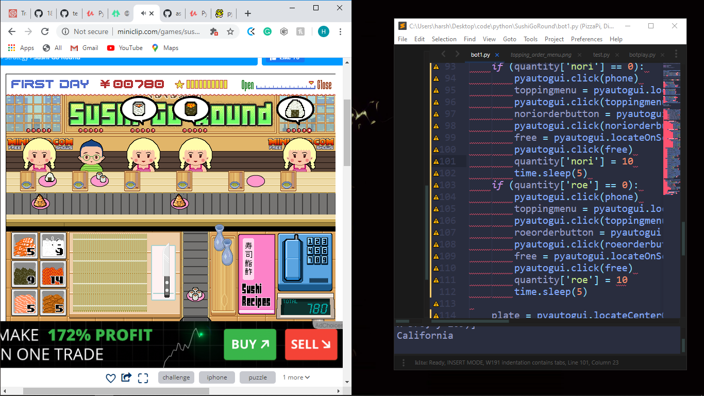

*Run The botmain.py File 

# Sushi-Go-Round-Bot
A bot that plays the Sushi Go Round flash game using PyAutoGUI.

To use, install the PyAutoGUI module from https://pypi.python.org/pypi/PyAutoGUI or run 'sudo pip install pyautogui'

Load the Sushi Go Round game in a browser. It is available at http://miniclip.com/games/sushi-go-round/en/

Run the program with the game fully visible. Do not move the browser window while the game is playing.

To interrupt the program and regain control of the mouse, move the mouse to the top-left corner of your screen.

run the code in this manner:

let the bot play the game and watch it winning (donot touch or move the mouse)
.png)
